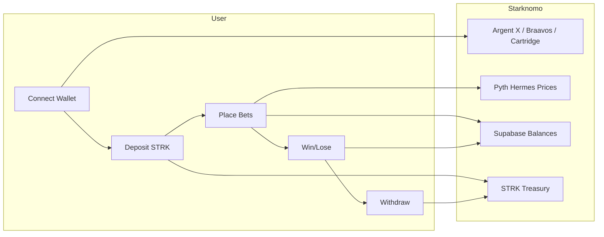
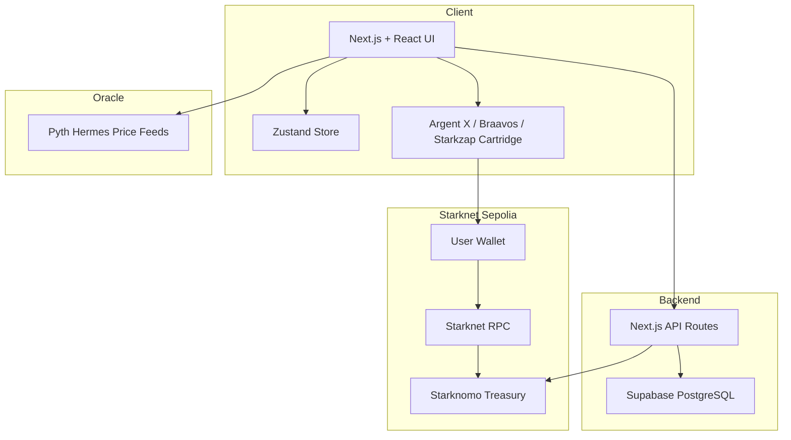
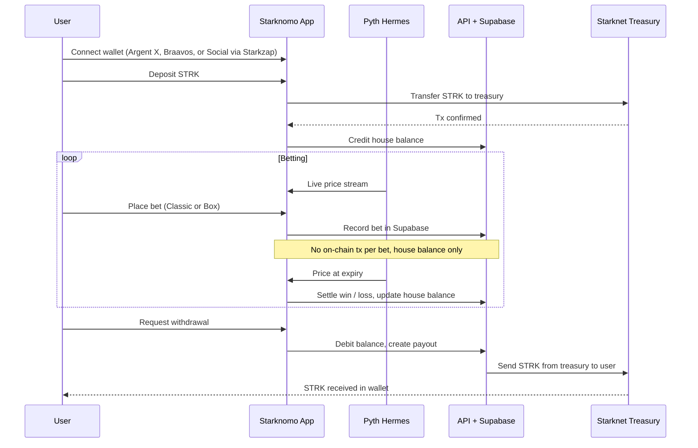
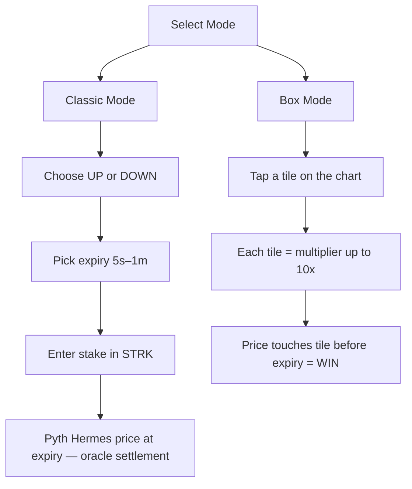

# Starknomo

[](https://opensource.org/licenses/MIT)
[](https://Starknet.org/)
[](https://nextjs.org/)
[](https://www.typescriptlang.org/)

**The first on-chain binary options trading dApp on Starknet.**  
Running on **Starknet Sepolia**.

Powered by **Starknet Sepolia** + **Pyth Hermes** price attestations + **Supabase** + instant house balance + **StarkZap**

*Users and Traders can Trade binary options with oracle-bound resolution and minimal trust.*

| Link | URL |
|------|-----|
| **GitHub** | [https://github.com/AmaanSayyad/Starknomo](https://github.com/AmaanSayyad/Starknomo) |
| **Pitch deck** | [https://docs.google.com/presentation/d/1xZWBd89C8WzgLBB_WX8ySgGh5mZ2Czrd3w5mTWtACOQ/edit?usp=sharing](https://docs.google.com/presentation/d/1xZWBd89C8WzgLBB_WX8ySgGh5mZ2Czrd3w5mTWtACOQ/edit?usp=sharing) |
| **Live app** | [https://starknomo-puce.vercel.app/trade](https://starknomo-puce.vercel.app/trade) |
| **Demo video** | *to be added* |

**Treasury (Starknet Sepolia):** For users who connect via **Social Login** (powered by Starkzap), there is no treasury EOA to manage — deposits and withdrawals go through the app. If you use the **normal flow** with a ready wallet (Argent X, Braavos), you can send STRK to the app’s treasury EOA: `0x2b13984f62a6b0bcd9cc312dbec3cdcd7d8a7c25eb5748ce01e394e2f057049`. Set `NEXT_PUBLIC_STARKNET_TREASURY_ADDRESS` in `.env` to this address for the app to recognize it for running locally.

## Evaluation repository

**This public GitHub repository is the single source used for all evaluations.** It contains:

| Content | Location |
|--------|----------|
| **Core code** | `app/`, `components/`, `lib/`, `supabase/`, `scripts/` — full Next.js app, Starknet integration, Pyth, Supabase |
| **README** | This file — overview, quick start, tech stack, architecture, getting started |
| **Architecture & flow (`.md` + Mermaid)** | **README.md** (How It Works, System Architecture, Data Flow, Game Modes) · **docs/TECHNICAL.md** (architecture, setup, demo) · **docs/PROJECT.md** (problem, solution, user journey) |

All architectural and flow diagrams are in Markdown using [Mermaid](https://mermaid.js.org/) (rendered on GitHub). No evaluation materials live outside this repo.

---

## 📚 Documentation

- **[Quick Start](#getting-started)** - Get up and running in 5 minutes
- **[Technical guide](./docs/TECHNICAL.md)** - Architecture, setup, and run/demo
- **Roadmap** — See [Future](#future) and [Expansion Roadmap](#adoption--growth-plan--go‑to‑market) below
- **[How It Works](#how-it-works)** — End‑to‑end trader flow (connect, deposit, bet, withdraw)
- **[Key Dependencies & Credits](#key-dependencies--credits)** — Open-source dependencies and acknowledgements

**Open source:** This repository is public and **fork-friendly**. The project is licensed under [MIT](./LICENSE); see the [LICENSE](./LICENSE) file for the full text.

---

## Repository structure

| Path | Purpose |
|------|--------|
| `app/` | Next.js App Router pages and API routes |
| `components/` | React UI components (trade, chart, wallet) |
| `lib/` | STRK config, Supabase client, Pyth, utilities |
| `docs/` | PROJECT.md, TECHNICAL.md, EXTRAS.md, starknet.address.json |
| `scripts/` | Balance sync, reconciliation, DB helpers |
| `supabase/` | SQL migrations and Supabase config |
| `public/` | Static assets |

---

## Why Starknomo?

Today, **binary options trading in the Web3 world does not exist at all.**  
Apps in the Web2 world are broken, fraudulent, and algorithmically biased.

**Why?** Because there were no real-time data oracles that could deliver price feeds in **&lt;1 second.**

- **590 million** crypto users and **400 million** transactions happen on the top 200 blockchains **every single day**.
- One big news, one big move, one big crash — **oracles crash.** That caused a huge gap between the existence and reality of a high-demand dApp like Starknomo.

---

### Solution — Starknomo

- **Every millisecond** is tracked by **Pyth oracles** to pull real-time data.
- Users and traders can trade **300+ crypto**, **10+ stocks**, **5+ metals**, **10+ forex** on a real-time price chart.
- **Bet unlimited times** without signing a transaction (house balance).
- Trade binary options at **lightning speed**: **5s, 10s, 15s, 30s, 1m** timeframes.
- **Infinite transactions**, no cap amounts, **one single treasury**.
- **1–10x leverage**; trade in open crypto markets freely.
- **Settlement in &lt;0.001 ms.**

Like Binomo of Web2 — but **10x better** than any other dApp in existence.

**More details / Pitch deck:** [Starknomo Pitch Deck](https://docs.google.com/presentation/d/1xZWBd89C8WzgLBB_WX8ySgGh5mZ2Czrd3w5mTWtACOQ/edit?usp=sharing) · **GitHub:** [github.com/AmaanSayyad/Starknomo](https://github.com/AmaanSayyad/Starknomo)

---

## Tech Stack

| Layer        | Technology |
|-------------|------------|
| **Frontend** | Next.js 16, React 19, TypeScript, Tailwind CSS, Zustand, Recharts |
| **Wallets & onboarding** | **Starkzap** (Cartridge Controller), Social Login, Argent X, Braavos |
| **Blockchain** | **Starknet Sepolia**, starknet.js, STRK |
| **Oracle** | Pyth Network Hermes (real-time prices) |
| **Backend** | Next.js API Routes, Supabase (PostgreSQL) |
| **Payments** | STRK native transfers, single treasury; **gasless deposits** via Starkzap/Cartridge paymaster |

### Starkzap integration (core focus)

Starknomo is built around **Starkzap** and **Cartridge** for a seamless Starknet experience:

- **Starkzap SDK** — unified wallet interface (Social + extension wallets), execute flows, and fee modes.
- **Cartridge Controller** — embedded wallet with **Social Login** (email, Google, Discord); no seed phrase required.
- **Gasless STRK deposits** — sponsored transfers via Cartridge’s built-in paymaster for policy-allowed STRK transfers; users can deposit without paying gas when the account supports SNIP-9.
- **Fallback to user-paid gas** — if sponsored is unavailable (e.g. account not SNIP-9 compatible), transfers run with `user_pays` (user pays gas in STRK).
- **Policy-based sponsorship** — STRK `transfer` to the app treasury is configured as an allowed policy so Cartridge automatically sponsors matching deposits.

### Key Dependencies & Credits

- **Next.js 16 & React 19** — core application framework and UI rendering.
- **TypeScript** — type-safe application codebase.
- **Tailwind CSS** — utility-first styling for a responsive trading UI.
- **Zustand** — lightweight global state for prices, rounds, and UI state.
- **Recharts** — charting library for price feeds and Box mode tiles.
- **Starkzap** — Starknet wallet abstraction; Cartridge (Social Login, gasless flows), execute API, fee modes.
- **@cartridge/controller** — Cartridge embedded wallet and paymaster integration used via Starkzap.
- **starknet.js** — underlying Starknet RPC and account layer used by Starkzap.
- **Argent X / Braavos** — Starknet extension wallets (in addition to Social Login).
- **Pyth Hermes** — real-time oracle prices for settlement.
- **Supabase (PostgreSQL)** — managed database, auth, and SQL migrations.

---

## Market Opportunity

| Metric | Value |
|--------|--------|
| **Binary options / prediction (TAM)** | $27.56B (2025) → ~$116B by 2034 (19.8% CAGR) |
| **Crypto prediction markets** | $45B+ annual volume (Polymarket, Kalshi, on-chain) |
| **Crypto derivatives volume** | $86T+ annually (2025) |
| **Crypto users** | 590M+ worldwide |

---

## Competitive Landscape

| Segment | Examples | Limitation vs Starknomo |
|--------|----------|----------------------|
| **Web2 binary options** | Binomo, IQ Option, Quotex | Opaque pricing, regulatory issues, no on-chain settlement; users do not custody funds. |
| **Crypto prediction markets** | Polymarket, Kalshi, Azuro | Event/outcome markets (e.g. “Will X happen?”), not sub-minute **price** binary options; resolution in hours or days. |
| **Crypto derivatives (CEX)** | Binance Futures, Bybit, OKX | Leveraged perps and positions; not short-duration binary options (5s–1m) with oracle-bound resolution. |
| **On-chain options / DeFi** | Dopex, Lyra, Premia | Standard options (calls/puts), complex UX; no simple “price up/down in 30s” binary product. |
| **Starknet Sepolia binary options** | — | No established on-chain binary options dApp; Starknomo fills this gap. |

**Starknomo’s differentiation:** First on-chain binary options dApp on Starknet Sepolia with sub-second oracle resolution (Pyth Hermes), house balance for instant bets, and dual modes (Classic + Box) in one treasury.

---

## Future

Endless possibilities across:

- **Stocks, Forex** — Expand beyond crypto into traditional markets via oracles.
- **Options** — Standard options (calls/puts) on top of the same infrastructure.
- **Derivatives & Futures** — More products for advanced traders.
- **DEX** — Deeper DeFi integration and on-chain liquidity.

**Ultimate objective:** To become the next PolyMarket for binary options — the go-to on-chain venue for short-duration, oracle-settled binary options on Starknet Sepolia and beyond.

---

## How It Works



### Flow

1. **Connect** — Connect via Argent X, Braavos, or Social Login (Starkzap/Cartridge). All operations use **STRK** on Starknet Sepolia.
2. **Deposit** — Send STRK from your wallet to the Starknomo treasury. Your house balance is credited instantly.
3. **Place bet** — Choose **Classic** (up/down + expiry) or **Box** (tap tiles with multipliers). No on-chain tx per bet.
4. **Resolution** — Pyth Hermes provides the price at expiry; win/loss is applied to your house balance.
5. **Withdraw** — Request withdrawal; STRK is sent from the treasury to your wallet on Starknet Sepolia.

---

## System Architecture



### Data Flow



### Game Modes



---

## Getting Started

### Prerequisites

- Node.js 18+
- Yarn (or npm)
- A Starknet Sepolia wallet (e.g. Argent X) and some STRK
- Supabase project

### 1. Clone and install

```bash
git clone https://github.com/AmaanSayyad/Starknomo.git
cd Starknomo
yarn install
```

### 2. Environment variables

```bash
cp .env.example .env
```

Edit `.env` with the following variables. See `.env.example` for a complete template.

#### Required Variables

| Variable | Description |
|----------|-------------|
| `STARKNET_TREASURY_ADDRESS` | Treasury account address for withdrawals (server-side) |
| `STARKNET_TREASURY_PRIVATE_KEY` | Treasury private key for withdrawals (⚠️ KEEP SECRET - server-side only) |
| `NEXT_PUBLIC_STARKNET_TREASURY_ADDRESS` | Treasury address for client display |
| `NEXT_PUBLIC_STARKNET_SEPOLIA_RPC` | Starknet Sepolia RPC endpoint (client) |
| `STARKNET_SEPOLIA_RPC_SERVER` | Starknet Sepolia RPC for server (e.g. withdrawals); can match client RPC or use Alchemy |
| `NEXT_PUBLIC_SUPABASE_URL` | Supabase project URL (required for database operations) |
| `NEXT_PUBLIC_SUPABASE_ANON_KEY` | Supabase anonymous key (required for database operations) |
| `SUPABASE_SERVICE_ROLE_KEY` | Supabase service role key (server-side only; ⚠️ KEEP SECRET) |

#### Starknet Network Configuration (Optional - defaults provided)

| Variable | Default | Description |
|----------|---------|-------------|
| `NEXT_PUBLIC_STARKNET_SEPOLIA_CHAIN_ID` | `0x534e5f5345504f4c4941` | Starknet Sepolia chain ID |
| `NEXT_PUBLIC_STARKNET_SEPOLIA_EXPLORER` | `https://sepolia.voyager.online` | Block explorer URL |
| `NEXT_PUBLIC_STARKNET_CURRENCY` | `STRK` | Native currency name |
| `NEXT_PUBLIC_STARKNET_CURRENCY_SYMBOL` | `STRK` | Currency symbol for display |
| `NEXT_PUBLIC_STARKNET_CURRENCY_DECIMALS` | `18` | Native token decimals |
| `NEXT_PUBLIC_STRK_TOKEN_ADDRESS` | `0x04718f5a0fc34cc1af16a1cdee98ffb20c31f5cd61d6ab07201858f4287c938d` | STRK token contract |
| `NEXT_PUBLIC_STARKNET_WALLET_CONNECTOR` | `braavos` | Default wallet connector (e.g. `braavos`, `argentX`) |
| `NEXT_PUBLIC_STARKNET_CHAIN_ID` | `SN_SEPOLIA` | Starknet chain id for wallet connection |

#### Application Configuration (Optional - defaults provided)

| Variable | Default | Description |
|----------|---------|-------------|
| `NEXT_PUBLIC_APP_NAME` | `Starknomo` | Application name displayed in UI |
| `NEXT_PUBLIC_STARKNET_NETWORK` | `sepolia` | Network mode (`sepolia` or `mainnet`) |
| `NEXT_PUBLIC_ROUND_DURATION` | `30` | Default round duration in seconds |
| `NEXT_PUBLIC_PRICE_UPDATE_INTERVAL` | `1000` | Price update interval in milliseconds |
| `NEXT_PUBLIC_CHART_TIME_WINDOW` | `300000` | Chart time window in milliseconds (5 minutes) |
| `STARKNET_TREASURY_CAIRO_VERSION` | `1` | Cairo version for treasury account (0 or 1) |

Optional aliases (if same as treasury): `DEPLOYER_WALLET_ADDRESS`, `DEPLOYER_PRIVATE_KEY`.

**⚠️ Security Note:** Never commit `.env` to version control. All sensitive keys (private keys, secrets) should only be used server-side and never exposed to the client.

### 3. Supabase

1. Create a project at [supabase.com](https://supabase.com).
2. Run the SQL migrations in `supabase/migrations/` in the Supabase SQL Editor.

### 4. Run the app

```bash
yarn dev
```

Open [http://localhost:3000](http://localhost:3000); the app redirects to `/trade`.

### 5. Verify

- **Lint:** `yarn lint`
- **Tests:** `yarn test`
- No secrets in source: all keys and secrets live in `.env` (see [.env.example](./.env.example)); never commit `.env`.

---

## Architecture: How Starknomo Scales

Starknomo is designed for **high-throughput, low-latency** binary options trading on Starknet Sepolia.

### Performance Characteristics

| Metric | Value | Notes |
|--------|-------|-------|
| **Bet throughput** | 1,000+ bets/second | Off-chain house balance (no tx per bet) |
| **Price updates** | 1-second interval | Pyth Hermes real-time feed |
| **Concurrent users** | 10,000+ | Supabase PostgreSQL + connection pooling |
| **Settlement latency** | <100ms | In-memory bet resolution + DB write |
| **Blockchain finality** | ~3 seconds | Starknet Sepolia block time |

### Scalability Strategy

1. **Off-chain execution engine**  
   - Bets are placed against house balance (stored in Supabase)  
   - Only deposits/withdrawals hit the blockchain  
   - Eliminates gas costs and network congestion for betting

2. **Horizontal scaling**  
   - Stateless Next.js API routes (scale via Vercel/AWS)  
   - Supabase connection pooling (supports 10K+ connections)  
   - CDN caching for static assets

3. **Database optimization**  
   - Indexed queries on `wallet_address`, `resolved_at`  
   - Partitioned tables for bet history (monthly partitions)  
   - Read replicas for analytics queries

4. **Treasury management**  
   - **Phase 1 (current)**: Single treasury account  
   - **Phase 2 (Q2 2026)**: Multi-sig treasury (Gnosis Safe 3-of-5)  
   - **Phase 3 (Q3 2026)**: Smart contract vault with time-locks

5. **Risk mitigation**  
   - **Insurance fund**: 5% of protocol fees reserved for edge cases  
   - **Liquidity reserves**: 70% STRK, 20% USDT, 10% yield-bearing (Venus)  
   - **Circuit breaker**: Auto-pause if oracle deviation >5% or treasury <10% reserves

---

## Revenue Model & Sustainability

### Protocol Revenue Streams

| Source | Fee/Rate | Destination |
|--------|----------|-------------|
| **Protocol fees** | 1.5-2% per bet | 70% treasury reserves, 20% insurance fund, 5% team, 5% community |
| **Referral bonuses** | 10% of referrer fees | Paid from protocol fee allocation |
| **VIP tier upgrades** | Volume-based (no upfront fee) | Incentivizes higher betting activity |
| **Future: Token staking** | Variable APY | Reduces sell pressure, aligns incentives |

### Sustainability Plan

**Treasury Reserve Management:**
- Maintain **minimum 30% reserves** (if reserves drop below, pause bets until replenished)
- **Yield generation**: Deposit idle STRK into Venus Protocol (~5% APY)
- **Dynamic fee adjustment**: Increase fees if treasury health <50%, decrease if >80%

**Insurance Fund:**
- Covers oracle failures, smart contract exploits, or extreme loss events
- Target: $100K by end of 2026 (currently accumulating 5% of fees)

**Liquidity Incentives:**
- **Early users**: Bonus multipliers for first 30 days (1.1x payouts)
- **Liquidity mining**: Stake Starknomo tokens to earn protocol fee share (planned Q3 2026)
- **Referral bonuses**: 10% of fees from referred users (permanent)

**Long-term Revenue Targets:**

| Quarter | Users | Daily Volume | Monthly Revenue | Treasury TVL |
|---------|-------|--------------|-----------------|--------------|
| Q1 2026 | 1,000 | $10K | $6K | $50K |
| Q2 2026 | 5,000 | $50K | $30K | $250K |
| Q3 2026 | 20,000 | $250K | $150K | $1M |
| Q4 2026 | 50,000 | $1M | $600K | $5M |

**Break-even:** Estimated at 2,500 users with $25K daily volume (achievable Q2 2026)

---

## Adoption & Growth Plan / Go‑to‑Market

### Target Segments

- **DeFi-native traders on Starknet Sepolia** — users already active on Starknet perps/DEXs looking for new high-frequency products.
- **Binary options & prediction users (Web2 → Web3)** — users of Binomo/IQ Option and prediction markets seeking transparent, on-chain settlement.
- **Creators & communities** — KOLs, trading groups, and Telegram/Discord communities who want gamified trading experiences.

### Acquisition Channels

- **Starknet Sepolia ecosystem**: Grants, ecosystem programs, and co-marketing with Starknet Sepolia and infra partners.
- **X/Twitter & Telegram**: Short-form trade clips, PnL screenshots, and streak highlights for virality.
- **Referral program**: Perpetual fee share for referrers, with deep links into Classic and Box modes.
- **Launch partners**: Early integrations with wallets, analytics dashboards, and trader communities.

### Activation & Retention

- **Onboarding quests**: Complete first deposit and 3 trades to unlock boosted odds or fee discounts.
- **Streaks & leaderboards**: Daily/weekly leaderboards for hit-rate, multipliers, and volume.
- **VIP tiers**: Volume-based tiers with better odds, early access to new assets, and governance rights.
- **Education & transparency**: Clear docs about oracle settlement, treasury health, and risk disclosures.

### Expansion Roadmap

- **Phase 1 (Starknet Sepolia focus)**: Ship on Starknet, harden infra, iterate on UX and risk parameters.
- **Phase 2 (More assets & regions)**: Expand to FX, indices, and region-specific campaigns.
- **Phase 3 (Cross-chain & tokenization)**: Starknomo token, cross-chain deployment, and deeper DeFi integrations.

---

## Documentation

- **[Technical guide](./docs/TECHNICAL.md)** - Architecture, setup, and run/demo
- **Roadmap** — See [Future](#future) and [Expansion Roadmap](#adoption--growth-plan--go‑to‑market) below

---

## Starknet Sepolia

Starknomo is built for **Starknet Sepolia**:

- Deposits and withdrawals are STRK transfers on Starknet Sepolia.
- Treasury is a Starknet account on Starknet Sepolia; no custom contract required for core flow.
- Wallet connection via Argent X or Braavos.
