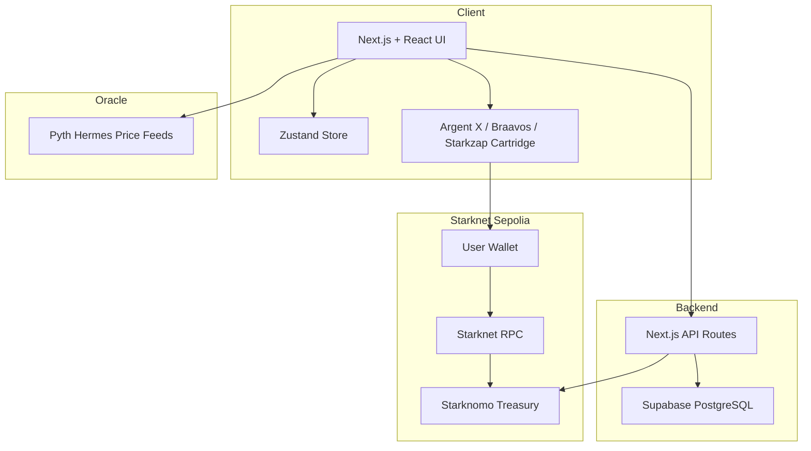
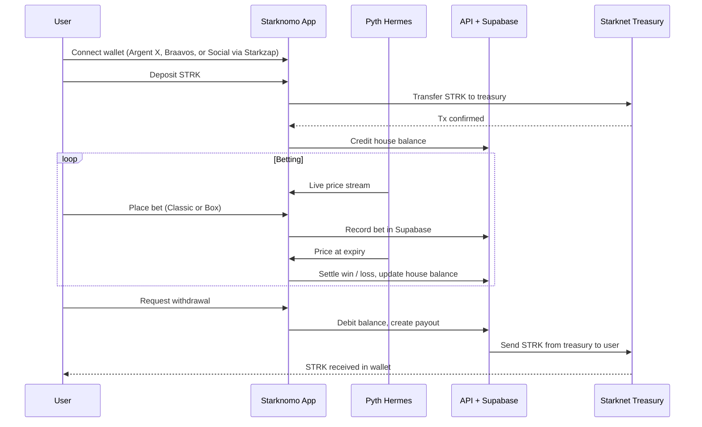

# Starknomo Technical — Architecture, Setup & Demo

One place for **how Starknomo works** and how to **run and demo** it quickly.

---

## 1. Architecture

### System Overview

Starknomo is a **Next.js 16 + React 19** app built **only for Starknet** (Starknet Sepolia), with a strong focus on **Starkzap** and **Cartridge** for wallets and gasless UX:

- **Frontend**: Next.js App Router UI, Tailwind CSS, Zustand for state.
- **Wallets & onboarding**: **Starkzap** SDK with **Cartridge Controller** — Social Login (email, Google, Discord), gasless STRK deposits via Cartridge’s paymaster, and fallback to user-paid gas when sponsored is not available. Extension wallets (Argent X, Braavos) via starknet.js.
- **On-chain layer**: Starknet Sepolia — STRK treasury (deposits/withdrawals only).
- **Oracle**: **Pyth Hermes** price feeds for sub‑minute binary options.
- **Backend**: Next.js API routes + **Supabase (PostgreSQL)** for balances, bets, referrals, and logs.

High‑level component diagram:



### Data Flow



### On-chain vs Off-chain

- **On-chain (Starknet Sepolia only)**
  - STRK deposits into the **treasury** (see `docs/starknet.address.json` and `.env`).
  - STRK withdrawals from treasury back to user wallets.
- **Off-chain**
  - House balances, bet records, referrals, and session data stored in **Supabase**.
  - Bet placement and settlement are processed off‑chain using Pyth prices; only net deposits/withdrawals touch the chain.

### Security & Risk Mitigation (Phase 1)

- **Treasury**
  - Controlled treasury with planned upgrade to multi‑sig + vaults (see README [Architecture](README.md#architecture-how-starknomo-scales) and Future sections).
  - Operational limits on withdrawal size and monitoring for anomalies.
- **Oracle**
  - Pyth Hermes with planned **circuit breakers** for large price deviations.
  - Insurance fund funded from protocol fees (see `README.md` revenue model).
- **Backend & DB**
  - Supabase row‑level security for user data.
  - Separation of public/secret keys; secrets never exposed to client.

### Contract & deployment addresses

- **Docs (JSON):** [`docs/starknet.address.json`](./starknet.address.json) — Starknet Sepolia addresses and URLs.

| Field | Purpose |
|-------|--------|
| `projectName` | Starknomo |
| `network` | Starknet Sepolia |
| `contracts` | Treasury, STRK token (addresses from env) |
| `frontendUrl` | Live app URL |
| `backendApi` | Base API URL |

Set `NEXT_PUBLIC_STARKNET_TREASURY_ADDRESS`, `NEXT_PUBLIC_STARKNET_SEPOLIA_RPC`, and related env vars. For local runs, use `http://localhost:3000`.

---

## 2. Setup & Run

This section is the **shortest path** to run the app.

### Prerequisites

- **Node.js**: v18+ (v20 LTS recommended)
- **Yarn** (or npm)
- **Git**
- **Starknet wallet** (Argent X, Braavos, or Cartridge on Starknet Sepolia)
- **Supabase project** (free tier is enough)

### Environment

1. Copy the example environment:

```bash
cp .env.example .env
```

2. Fill in minimum required values in `.env`:

- `NEXT_PUBLIC_STARKNET_SEPOLIA_RPC` and `STARKNET_SEPOLIA_RPC_SERVER` — Starknet Sepolia RPC (client and server)
- `NEXT_PUBLIC_STARKNET_TREASURY_ADDRESS`, `STARKNET_TREASURY_ADDRESS`, `STARKNET_TREASURY_PRIVATE_KEY` — treasury for deposits/withdrawals
- `NEXT_PUBLIC_SUPABASE_URL`, `NEXT_PUBLIC_SUPABASE_ANON_KEY`, `SUPABASE_SERVICE_ROLE_KEY`
- STRK token and app config as in `.env.example`

See [README.md](../README.md#2-environment-variables) and `.env.example` for the full variable list.

### Install & Build

```bash
git clone https://github.com/AmaanSayyad/Starknomo.git
cd Starknomo
yarn install
```

No separate build step is required for local development (`yarn dev` runs the app in dev mode).

### Run

```bash
yarn dev
```

Then open:

- `http://localhost:3000` → redirects to `/trade`

You should see the Starknomo trading interface with asset selector, chart, and Classic/Box modes.

### Environment config safety

- All secrets and keys are **externalized** via `.env`; see root `.env.example` for the full template.
- **Never commit `.env`** (it is in `.gitignore`); use `.env.example` as reference.
- No API keys or private keys are hardcoded in source; the app reads only `process.env.*`.

### Verify

At minimum, to confirm the app is working:

- The landing page loads without errors.
- You can open the connect wallet dialog (Starknet wallets: Argent X, Braavos, Cartridge).
- Price feed and chart update periodically (when correctly configured with Pyth).
- UI state updates when switching assets and modes.

---

## 3. Demo Guide

### Access

**Production (no setup):** Open [https://starknomo-puce.vercel.app/](https://starknomo-puce.vercel.app/) (or [/trade](https://starknomo-puce.vercel.app/trade)) in your browser.

**Local:**
1. Start the dev server: `yarn dev`
2. Open `http://localhost:3000` (redirects to `/trade`).

### User Flow (Classic Mode)

1. **Connect**
   - Click “Connect Wallet” and choose Starknet wallet (Argent X, Braavos) or Social Login (Cartridge).
2. **Deposit (Starknet Sepolia)**
   - Send a small amount of STRK from your wallet to the treasury (or use the in-app deposit flow).
   - Wait for confirmation; the **house balance** in the UI should update.
3. **Place a Classic bet**
   - Select an asset (e.g. BTC/USDT) and a short duration (e.g. 30s).
   - Choose **UP** or **DOWN**, enter a small stake, and confirm.
   - Watch the countdown; at expiry, Starknomo uses **Pyth Hermes** to resolve the outcome and adjusts your house balance.
4. **Review history**
   - Open the history panel to see the bet result and PnL.

### User Flow (Box Mode)

1. Switch to **Box Mode** in the UI.
2. Tap one or more tiles with desired multipliers (e.g. 3x, 5x).
3. Enter a total stake and confirm.
4. If price **touches the tile before expiry**, you win; otherwise you lose. Winnings and losses are applied to your house balance.

### Expected Outcomes

- **House balance** updates correctly after wins/losses.
- **Charts and timers** behave smoothly during the round.
- Bets are **stored and retrievable** from history (backed by Supabase).

### Troubleshooting

- **Blank screen or build error**
  - Ensure Node 18+ and a clean install: `rm -rf node_modules .next && yarn install && yarn dev`.
- **Wallet connection issues**
  - Confirm the wallet is on **Starknet Sepolia**.
  - Check RPC and treasury env vars.
- **No price data**
  - Verify Pyth configuration and Hermes endpoints (see [Pyth Hermes docs](https://docs.pyth.network/price-feeds/hermes)).

For more detailed troubleshooting and production deployment notes, see `README.md`.
